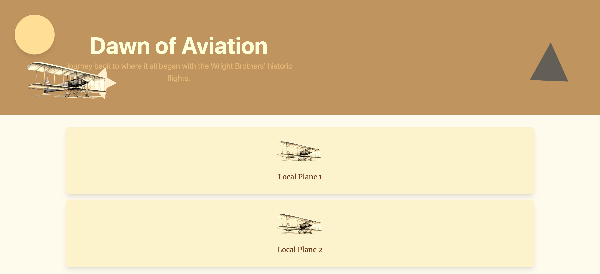
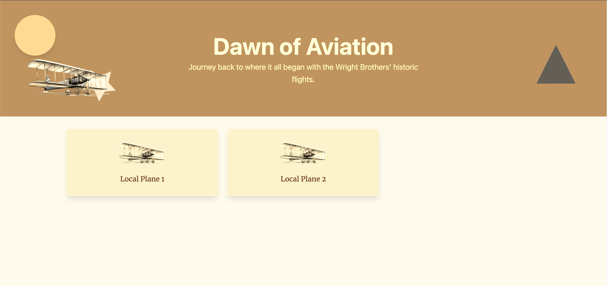

# Lab 3.1 - Wing and Tail Design ✈ Frontend Styling with GitHub Copilot

During the weekly multi-disciplinary meeting of the Wright Bros team, the UX Designers have presented a new design for the application. This new design is essential for the project as it will improve the user experience of the application. Together with everyone in the meeting, you discussed that implementing the new design is the first priority for the project. You have become confident in your ability to work with the backend of the project, especially with GitHub Copilot as your co-pilot. You have little experience with frontend development from your previous projects, but you are eager to learn and improve your skills. After experiencing the power of GitHub Copilot, you are confident that it can help you with the frontend as well.

In the team inbox you find a message from the UX Designers with a screenshot of the new design for the application. The screenshot shows the to-be situation of the page. The screenshot is accompanied by a description of the elements that need to be styled. You are excited to start working on the frontend of the project and bring your expertise to the team.

## Estimated time to complete

- 20 min

## As Is Situation



## To Be Situation

The UX Designers have provided the following description of the elements that need to be styled:

1. Center and align elements in the component / page
2. Change colors and contrast of the subtitle
3. Change the list of planes to a grid layout




## Learning objectives

- Use GitHub Copilot to style the frontend of the project acting like a UX Designer

## Task 1: Change colors and contrast of the subtitle

Explore frontend technologies while enhancing usability and accessibility.

The subtitle of the banner is hard to read because of the low contrast with the background. Change colors and contrast of the subtitle using GitHub Copilot to make it more accessible to users with visual impairments.

<br/>

> [!IMPORTANT]
> **WCAG (Web Content Accessibility Guidelines)** are international standards for accessible web content, built on four principles — **Perceivable, Operable, Understandable, Robust** (POUR). A key requirement is sufficient color contrast between text and its background so users with visual impairments can read content clearly.

<br/>

---

<br/>

**Hints**

Below you can find hints that can help you to solve the task at hand.

<details>
  <summary>Click to open Hint 1</summary>

- Ask GitHub Copilot how to run the frontend application:

  ```
  How do I run the frontend application locally?
  ```

- Open the browser and navigate to the homepage.

- Note the contrast of the subtitle is not optimal.

</details>

<br/>

<details>
  <summary>Click to open Hint 2</summary>

- If you're unfamiliar with the frontend tech stack, ask Copilot to orient you first:

  ```
  What frontend framework, CSS library, and build tool does this project use? How is the project structured?
  ```

</details>

<br/>

<details>
  <summary>Click to open Hint 3</summary>

- Describe what changes you want to make to the subtitle in Copilot Chat (Agent Mode):

  ```
  Change the subtitle on the homepage to have better color contrast for accessibility.
  ```

</details>

---

<br/>

**Expert solution**

Below you can find the solution to the task. The expert solution is a step-by-step guide on how the expert would solve the task.

<details>
  <summary>Click to open Expert Solution</summary>


<br/>

- Open GitHub Copilot Chat (Agent Mode) and enter the following prompt:

  ```
  In Banner.tsx, change the subtitle text color to have better contrast against the amber background for WCAG accessibility.
  ```

- To make the subtitle on the homepage easier to read for people, you can increase the font size and change the color to a higher contrast. Here is the exact HTML you need to change in the `wright-brothers-frontend/src/components/Banner.tsx` component.

  ```html
  <p className="text-xl leading-8 text-amber-500">
    Journey back to where it all began with the Wright Brothers' historic
    flights.
  </p>
  ```

- If you are not familiar with the (TailwindCSS) classes used, ask GitHub Copilot to explain this technology:

  ```
  I don't understand where the css classes come from. Can you explain this to me?
  ```

- GitHub Copilot will explain that the classes are from the TailwindCSS library and that you can use them to style the components.

- Now, replace the `<p>` element for the subtitle with the generated code

  ```html
  <p className="text-2xl leading-10 text-amber-100">
    Journey back to where it all began with the Wright Brothers' historic
    flights.
  </p>
  ```

- This increases the font size to `text-2xl`, the line height to `leading-10`, and changes the text color to `text-amber-100` for better readability.

- Open the browser and check if the subtitle has a better contrast with the background

</details>

---

## Task 2: Center and align elements

The title of the banner is currently aligned to the left. Center the title and subtitle of the banner that is displayed on the homepage of the application.

---

**Hints**

Below you can find hints that can help you to solve the task at hand.

<details>
  <summary>Click to open Hint 1</summary>

- Find the As Is and To Be situation of the page in the challenge description above. Note that the title and subtitle of the banner are not centered in the As Is situation.

</details>

<br/>

<details>
  <summary>Click to open Hint 2</summary>

- Describe to GitHub Copilot that you want to center the title and subtitle of the banner:

  ```
  Center the title and subtitle of the banner on the homepage.
  ```

</details>

---

**Expert solution**

Below you can find the solution to the task. The expert solution is a step-by-step guide on how the expert would solve the task.

<details>
  <summary>Click to open Expert Solution</summary>

<br/>

- Open GitHub Copilot Chat (Agent Mode) and enter the following prompt:

  ```
  In Banner.tsx, center the title and subtitle inside the banner div.
  ```

- GitHub Copilot will suggest to add one of the following to the `div` element that need to be centered. `className="flex flex-col items-center justify-center"` or `className="text-center"`

- Note: With the amount of Tailwind CSS classes generated by GitHub Copilot, it's hard to understand the changes made to the code. Make sure to read the generated code from GitHub Copilot carefully.

  ```tsx
  const Banner: React.FC = () => {
    return (
      <div className="relative p-28 sm:px-32 lg:px-36 vintage-filter bg-amber-600 overflow-hidden">
        <div className="flex flex-col items-center justify-center">
          <h1 className="text-5xl leading-none font-bold text-amber-100 sm:text-6xl sm:leading-tight">
            Dawn of Aviation
          </h1>
          <p className="text-xl leading-8 text-amber-500">
            Journey back to where it all began with the Wright Brothers'
            historic flights.
          </p>
        </div>
        <div className="absolute top-10 left-10">
          <div className="circle shadow-lg pulse-gentle"></div> {/* Sun with pulsing effect */}
        </div>
        <div className="absolute bottom-20 right-20">
          <div className="triangle drift-slow"></div> {/* Triangle with drifting effect */}
        </div>
        <div className="absolute left-16 bottom-8">
          <div className="absolute bottom-0 left-16">
            <PropellerSVG /> {/* Propeller with shadow */}
          </div>
          <div className="absolute bottom-0 left-0 mt-8 float-gentle">
            <Airplane />
          </div>
        </div>
      </div>
    );
  };
  ```

- Replace the `Banner.tsx` component with the updated code

- Open the browser and check if the title and subtitle are centered in the banner

</details>

---

## Task 3: Change the list of planes to a grid layout

Change the list of planes to a grid layout using GitHub Copilot

---

**Hints**

Below you can find hints that can help you to solve the task at hand.

<details>
  <summary>Click to open Hint 1</summary>

- Ask GitHub Copilot to change the list of planes to a grid layout:

  ```
  Change the list of planes to a grid layout.
  ```

</details>

<br/>

<details>
  <summary>Click to open Hint 2</summary>

- Use `#file:PlaneList.tsx` to give Copilot the style context:

  ```
  Change the list of planes in #file:PlaneList.tsx to a responsive grid layout.
  ```

</details>

<br/>

<details>
  <summary>Click to open Hint 3</summary>

- Make sure to run the frontend application and check if the list of planes is displayed in a grid layout

</details>


---

**Expert solution**

Below you can find the solution to the task. The expert solution is a step-by-step guide on how the expert would solve the task.

<details>
  <summary>Click to open Expert Solution</summary>

<br/>

- Open GitHub Copilot Chat (Agent Mode) and enter the following prompt:

  ```
  Change the list of planes to a grid layout. Make sure that it is responsive for different screen sizes.
  ```

- GitHub Copilot will suggest to change the list of planes to a grid layout inside the `wright-brothers-frontend/src/components/PlaneList.tsx` component:

  ```tsx
  const PlaneList: React.FC<PlaneListProps> = (props: PlaneListProps) => {
    // rest of the code

    const planes = props.planes || [];

    return (
      <div className="grid grid-cols-1 sm:grid-cols-2 md:grid-cols-3 lg:grid-cols-4 gap-4">
        {planes.map((plane) => (
          <div
            key={plane.id}
            onClick={(e) => handleClick(plane.id, e)}
            className="hover-tilt cursor-pointer flex flex-col text-center bg-amber-100 rounded-lg shadow-lg divide-y divide-amber-200"
          >
            {/* Vintage card styling */}
            <div className="flex-1 flex flex-col p-8">
              {" "}
              {/* Sepia filter for a vintage look */}
              <h3 className="mt-6 text-amber-900 text-lg leading-6 font-serif">
                {plane.name}
              </h3>{" "}
              {/* Vintage font and color */}
              <p className="text-amber-700 text-sm mt-2">{plane.year}</p>{" "}
              {/* Year styling */}
            </div>
          </div>
        ))}
      </div>
    );
  };

  export default PlaneList;
  ```

  - The `grid` class is used to create a grid layout with 1 column on small screens, 2 columns on medium screens, 3 columns on large screens, and 4 columns on extra-large screens. The `gap-4` class is used to add a gap between the grid items.

  - Now, run the frontend application and check if the list of planes is displayed in a grid layout and check if it is responsive for different screen sizes by using the browser's developer tools.

</details>

<br/>

## Optional - Bonus Tasks

> [!CAUTION]
> Please be aware that this challenge does not include guardrails or provided solutions. You are encouraged to navigate and solve the tasks independently, which will help enhance your problem-solving skills and deepen your understanding of the frameworks and technologies involved.

For if you have time left and full of curiosity, you can try these bonus tasks:

1. Change the background color of the banner to a gradient color

2. Change the font of the title in the banner

3. Any other changes you would like to make to the frontend application

<br/>

<details>
  <summary>Click to open Hint 1</summary>
  Use Copilot Agent mode with prompt

```
Add a new feature to the frontend application that allows users to view details, edit details, and delete a plane from the application using a modal form.
```

</details>

<br/>

### Congratulations you've made it to the end! &#9992;

#### And with that, you've now concluded this module. We hope you enjoyed it! &#x1F60A;

---

➡️ Continue to [Lab 3.2 • Creating Interactable Components](../Lab%203.2%20-%20Creating%20Interactable%20Components/README.md)
